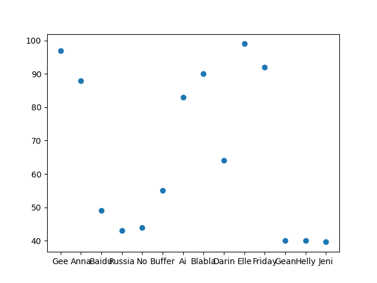

# Pandas Descriptive Statistics Script


This Python script is designed to perform descriptive statistics using the Pandas library. It reads a dataset from a CSV file, calculates summary statistics such as mean, median, and standard deviation, and creates a data visualization. 

## Requirements

- Python 3.x
- Pandas library
- Matplotlib library (for data visualization)
- A dataset in CSV format (replace 'data.csv' with your dataset)

## Usage

1. Ensure you have Python 3.x installed on your system.

2. Install the required libraries using pip if you haven't already:

   ```bash
   pip install pandas matplotlib
   ```

3. Clone this repository or download the script file (`script.py`) to your local machine.

4. Place your dataset file (in CSV format) in the same directory as the script, or specify the correct path in the script.

5. Run the script:

   ```bash
   python main.py
   ```

6. The script will calculate and display the mean, median, and standard deviation of the 'Score' column from your dataset. It will also create a scatter plot visualization of the data and save it as 'result.png' in the same directory.

## Result:


